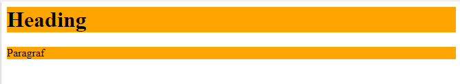
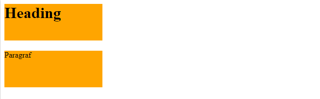
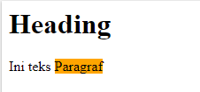
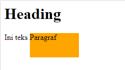

# HTML dan CSS Dasar

- [Display & Dimension]()
    - [Pengenalan Tag div dan span]()
    - [Sifat display block]()
    - [Sifat display inline]()
    - [Sifat display inline-block]()
    - [Sifat display none]()

## Display & Dimension

### A. Pengenalan Tag div dan span
Pada tag div dan span tidak ada fungsi khusus seperti h1, p, img dan tag semantik lainnya. Tag div dan span biasanya digunakan untuk mengelompokkan elemen html lalu memberi style secara spesifik. 

Perbedaan dari keduanya ialah tag div bersifat display block sedangkan tag span bersifat display inline


### B. Sifat display block
- membuat baris baru saat dirender
- Dapat diset lebar dan tingginya
- Bila lebar tidak diset, maka lebar elemen akan memenuhi lebar dari parentnya.
- Di dalamnya dapat disimpan elemen bertipe block, inline dan inline block.

Contoh tag yang memiliki nilai default block:
```html
<h1>-<h6>, <p>, <ul>, <ol>, <li>, <form>, <hr>
```

Contoh:
```html
<style>
    h1, p { background:orange }
</style>

<h1>Heading</h1>
<p>Paragraf</p>
```


Pada kode di atas kita tidak menentukan lebarnya, maka lebarnya akan memenuhi elemen parent.

Namun ketika diset lebar dan tingginya, maka lebarnya sesuai dengan yang sudah diset.

```html
<style>
    h1, p { 
    	background:orange; 
        width:200px;
        height:75px; 
    }
</style>

<h1>Heading</h1>
<p>Paragraf</p>
```


### C. Sifat display inline
- Tidak membuat baris baru saat dirender
- Lebar dan tinggi sebesar konten yang ada di dalamnya
- Lebar dan tingginya tidak dapat diatur
- Margin dan padding hanya mempengaruhi elemen secra horizontal, tidak vertikal

Contoh tag yang memiliki nilai default inline:
```html
<b>, <i>, <em>, <strong>, <a>, <span>, <sub>, <sup>, <mark>, <button>, <input>, <label>, <select>, <textarea>
```
Contoh:
```html
<style>
    span { background: orange }
</style>

<h1>Heading</h1>
<p>Ini teks <span>Paragraf</span></p>
```


Ketika kita tambahkan witdh dan height pada kelas span, maka tidak berpengaruh pada outputnya.
```html
<style>
    span { 
        background: orange;
        width:100px;
        height:50px;
    }
</style>

<h1>Heading</h1>
<p>Ini teks <span>Paragraf</span></p>
```


### C. Sifat display inline-block
- Tidak ada elemen html yang default bertipe inline-block
- Nilai property display dapat diset manual menjadi inline-block
- Sifat dasar sama dengan inline
- Inline-block akan berpengaruh dari property width dan height

Contoh:
```html
<style>
    span { 
        background: orange;
        width:100px;
        height:50px;
        display: inline-block;
    }
</style>

<h1>Heading</h1>
<p>Ini teks <span>Paragraf</span></p>
```


### D. Sifat display none
Property display none apabila diterapkan pada sebuah elemen maka elemen tersebut akan disembunyikan dari web browser

Contoh
```html
<style>
    span { 
        background: orange;
        width:100px;
        height:50px;
        display: none;
    }
</style>

<h1>Heading</h1>
<p>Ini teks <span>Paragraf</span></p>
```


## Referensi
- Display & Dimension - CodePolitan.com. (n.d.). Retrieved March 3, 2020, from https://www.codepolitan.com/course/lesson/basic-html-dan-css/02-Dasar-HTML-dan-CSS/04-display-dimension
- CSS display: inline vs inline-block - Stack Overflow. (n.d.). Retrieved March 3, 2020, from https://stackoverflow.com/questions/9189810/css-display-inline-vs-inline-block
