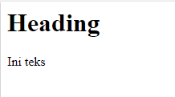

# HTML dan CSS Dasar

- [Display & Dimension]()
    - [Pengenalan Tag div dan span]()
    - [Sifat display block]()
    - [Sifat display inline]()
    - [Sifat display inline-block]()
    - [Sifat display none]()
- [Box Model & Overflow Handling]()
    - [Box Model]()
        - [Margin]()
        - [Padding]()
        - [Border]()
    - [Overflow Handling]()
- [CSS Float]()
- [CSS Position]()
    - [Static]()
    - [Relative]()
    - [Absolute]()
    - [Fixed]()
- [CSS Selector]()
    - [Selector Nama Tag]()
        - [Koma pada Selector]()
        - [Spasi pada Selector]()
    - [Selector dengan id dan class]()
    - [Selector Spesifik]()
    - [Selector Multi-Class]()
    - [Selector dengan Atribut]()
    - [Selector Pseudoclass]()

<hr>

## A) Display & Dimension

### 1) Pengenalan Tag div dan span
Pada tag div dan span tidak ada fungsi khusus seperti h1, p, img dan tag semantik lainnya. Tag div dan span biasanya digunakan untuk mengelompokkan elemen html lalu memberi style secara spesifik. 

Perbedaan dari keduanya ialah tag div bersifat display block sedangkan tag span bersifat display inline


### 2) Sifat display block
- membuat baris baru saat dirender
- Dapat diset lebar dan tingginya
- Bila lebar tidak diset, maka lebar elemen akan memenuhi lebar dari parentnya.
- Di dalamnya dapat disimpan elemen bertipe block, inline dan inline block.

Contoh tag yang memiliki nilai default block:
```html
<h1>-<h6>, <p>, <ul>, <ol>, <li>, <form>, <hr>
```

Contoh:
```html
<style>
    h1, p { background:orange }
</style>

<h1>Heading</h1>
<p>Paragraf</p>
```


Pada kode di atas kita tidak menentukan lebarnya, maka lebarnya akan memenuhi elemen parent.

Namun ketika diset lebar dan tingginya, maka lebarnya sesuai dengan yang sudah diset.

```html
<style>
    h1, p { 
    	background:orange; 
        width:200px;
        height:75px; 
    }
</style>

<h1>Heading</h1>
<p>Paragraf</p>
```


### 3) Sifat display inline
- Tidak membuat baris baru saat dirender
- Lebar dan tinggi sebesar konten yang ada di dalamnya
- Lebar dan tingginya tidak dapat diatur
- Margin dan padding hanya mempengaruhi elemen secra horizontal, tidak vertikal

Contoh tag yang memiliki nilai default inline:
```html
<b>, <i>, <em>, <strong>, <a>, <span>, <sub>, <sup>, <mark>, <button>, <input>, <label>, <select>, <textarea>
```
Contoh:
```html
<style>
    span { background: orange }
</style>

<h1>Heading</h1>
<p>Ini teks <span>Paragraf</span></p>
```


Ketika kita tambahkan witdh dan height pada kelas span, maka tidak berpengaruh pada outputnya.
```html
<style>
    span { 
        background: orange;
        width:100px;
        height:50px;
    }
</style>

<h1>Heading</h1>
<p>Ini teks <span>Paragraf</span></p>
```


### 4) Sifat display inline-block
- Tidak ada elemen html yang default bertipe inline-block
- Nilai property display dapat diset manual menjadi inline-block
- Sifat dasar sama dengan inline
- Inline-block akan berpengaruh dari property width dan height

Contoh:
```html
<style>
    span { 
        background: orange;
        width:100px;
        height:50px;
        display: inline-block;
    }
</style>

<h1>Heading</h1>
<p>Ini teks <span>Paragraf</span></p>
```


### 5) Sifat display none
Property display none apabila diterapkan pada sebuah elemen maka elemen tersebut akan disembunyikan dari web browser

Contoh
```html
<style>
    span { 
        background: orange;
        width:100px;
        height:50px;
        display: none;
    }
</style>

<h1>Heading</h1>
<p>Ini teks <span>Paragraf</span></p>
```


<hr>

## B) Box Model & Overflow Handling

### 1) Box Model
Setiap elemen di halaman HTML direpresentasikan sebagai sebuah kotak. Kita bisa mengatur ukuran maupun posisi kotak tersebut.


- Margin<br>Jarak spasi antara satu elemen dengan elemen lain atau elemen parentnya. Margin bersifat transparan.
- Border<br>Batas garis yang mengelilingi padding dan content.
- Padding<br>Jarak spasi antara border dan content. Padding bersifat transparan.
- Content<br>Isi dari elemen, bisa berupa text atau elemen lain. Text, gambar atau elemen lainnya ditampilkan di bagian ini.

#### 1.1) Property margin

Nilai propertinya => px, %, auto.

Contoh:
```html
<style>
  p {
      background: orange;
      width: 160px;
      height: 160px;
      margin: 20px 50px 30px 25px;
  }
</style>

<p>Lorem ipsum dulur amet amet</p>
```


```html
<style>
  p {
      background: orange;
      width: 160px;
      height: 160px;
      margin: 20px auto;
  }
</style>

<p>Lorem ipsum dulur amet amet</p>
```


Info lebih lanjut mengenai property-property margin bisa ditemukan di https://developer.mozilla.org/en-US/docs/Web/CSS/margin

#### 1.2) Property Padding

Nilai propertinya => px, %.

Contoh:
```html
<style>
  p {
      background: orange;
      width: 160px;
      height: 160px;
      padding: 20px 50px 30px 25px;
  }
</style>

<p>Lorem ipsum dulur amet amet</p>
```


Info lebih lanjut mengenai property-property padding bisa ditemukan di https://developer.mozilla.org/en-US/docs/Web/CSS/padding

#### 1.3) Property Border

```css
border : width style color;
```
- width : ukuran ketebalan border
- style : bentuk garis
    - dotted : garis dengan kombinasi bulat-bulat
    - dashed : garis dengan kombinasi garis putus-putus
    - solid : garis lurus
- color : warna dari border

Contoh:
```html
<style>
  div {
	height: 40px;
	margin: 20px 0;
  }
  
  #dotted {
  	border: 2px dotted black
  }
  
  #dashed {
  	border: 2px dashed red
  }
  
  #solid {
  	border: 2px solid blue
  }
</style>

<div id="dotted">Dotted</div>
<div id="dashed">Dashed</div>
<div id="solid">Solid</div>
```


### 2) Overflow Handling

Apa yang harus kita lakukan apabila kita menemui suatu kondisi ketika konten kita mengalami overflow?

```html
<style>
  div {
      background: orange;
      width: 80px;
      height: 80px;
      padding: 40px;
  }
</style>

<div>Laboris pariatur pariatur tempor fugiat sunt anim ad voluptate. Ex qui ad culpa velit sit. Duis quis nulla eu sunt.</div>
```


```html
<style>
  div {
      background: orange;
      width: 80px;
      height: 80px;
      padding: 40px;
      overflow: auto;
  }
</style>

<div>Laboris pariatur pariatur tempor fugiat sunt anim ad voluptate. Ex qui ad culpa velit sit. Duis quis nulla eu sunt.</div>
```


Lebih lengkapnya penanganan overflow bisa dilihat di sini https://developer.mozilla.org/en-US/docs/Web/CSS/overflow-x

<hr>

## C) CSS Float

CSS Float digunakan untuk memposisikan elemen dalam sebuat layout halaman website. Sebuah elemen bisa diposisikan seakan-akan berada mengapung diantara elemen setelahnya. Beberapa value yang digunakan untuk property float yaitu : left, right, none. Secara default float memiliki nilai none.

```html
<style>
  img {
      float: left;
      padding-right: 10px;
  }
</style>


<p>Duis proident sunt enim cupidatat occaecat consequat labore magna Lorem nostrud veniam excepteur deserunt. Ad laborum anim incididunt aliquip adipisicing eu ad ad laboris tempor commodo esse culpa. Tempor culpa aliqua esse dolore deserunt excepteur aliquip reprehenderit occaecat quis velit ipsum aliquip ullamco. Fugiat elit exercitation duis aliqua reprehenderit. Ut in ea adipisicing ea mollit nisi officia amet. Magna anim nisi laboris id sint voluptate et consequat.</p>
```


```css
float: right;
```


<hr>

## D) CSS Position

CSS Position itu terdiri dari 4 nilai, yaitu <strong>static, relative, absolute, dan fixed</strong>. Secara default, tag-tag yang kita buat sudah memiliki nilai <strong>position: static</strong>.

### 1) Static
- Static adalah nilai default dari tiap-tiap elemen ketika tidak diberi properti position
- Menggunakan position <strong>selain</strong> static (non-static), akan membuat sebuah elemen menjadi seolah olah berbeda dimensi dari elemen lainnya.
- Elemen yang diberi position <strong>selain</strong> static dapat menggunakan properti top, left, bottom dan right untuk mengatur posisinya.


### 2) Relative
- Ketika kita menggerakan elemen dengan posisi relative (menggunakan properti top, left. bottom dan right), ruang yang ditempati elemen tersebut masih ada
- Ketika kita menggerakan elemen dengan posisi relative, elemen akan bergerak relatif terhadap posisi semula-nya
- Jika kita memberi properti top: 0; dan left: 0; maka elemen tidak berubah posisinya.


### 3) Absolute
- Ketika kita menggerakan elemen dengan posisi absolute (menggunakan properti top, left, bottom dan right), ruang yang ditempati oleh elemen tersebut dianggap tidak ada.
- Ketika kita menggerakan elemen dengan posisi absolute, elemen akan bergerak relatif terhadap posisi dan elemen parent-nya, selama elemen parent-nya memiliki posisi yang juga non-static.
- Jika kita memberi properti top: 0; dan left: 0; maka elemen akan berada di ujung kiri atas dari elemen-nya.


Jika Absolute tidak memiliki parent relative maka posisinya akan seperti berikut ini:


### 4) Fixed
- Ketika kita menggerakan elemen dengan posisi fixed (menggunakan properti top, left, bottom dan right), ruang yang ditempati oleh elemen tersebut dianggap tidak ada.
- Jika kita memberi properti top: 0; dan left: 0; maka elemen akan berada di ujung kiri atas dari elemen parent-nya
- Elemen akan 'terkunci' dan tidak bergerak dari posisinya meskipun halaman di-scroll

<hr>

## E) CSS Selector
Pada css terdapat selector yang digunakan untuk memilih elemen HTML yang akan dikenai style, pemilihan elemen menggunakan nama tag, nilai atribut, atau pola tertentu.

### 1) Selector Nama Tag
Semisal kita ingin mewarnai body maka langsung saja ketikan selector body, begitupun dengan h1, p atau yang lainnya.

#### 1.1) Koma pada Selector
```css
h1, h2, h3, p {
    color: #666;
}
```

#### 1.2) Spasi pada Selector
```css
p span {
    background-color: #7CFC00;
}
```

### 2) Selector dengan id dan class
```css
#higlight {
    background-color: yellow
}

.red {
    color: red
}
```

### 3) Selector Spesifik
```html
<style>
  p.small {
      font-size: 0.8em;
  }
</style>

<h1 class="small">Judul ini tidak terpengaruh class small</h1>

<p>Ini elemen paragraf dengan ukuran normal 16px.</p>

<p class="small">Ini paragraf dengan ukuran lebih kecil </p>

<p class="small">Ini paragraf dengan ukuran normal seperti pertama.</p>
```


### 4) Selector multi-class
```html
<style>
  .red{
      color: red;
  }

  .big {
      font-size: 20px;
  }
</style>

<p class="big">paragraf ini berwarna default hitam dan teks diperbesar.</p>

<p class="red big">paragraf ini berwarna merah dan berukuran teks 20px.</p>
```


### 5) Selector dengan Atribut
```html
<style>
  input {
      width: 100%;
      padding: 10px;
  }
  
  input[type="password"] {
      border: 2px solid red;
  }
</style>

<form action="#">
  Nama : <br>
  <input type="text">

  Password: <br>
  <input type="password">
</form>
```


### 6) Selector Pseudoclass
```html
<style>
	div {
    	width: 100px;
        height: 100px;
        background-color: red;
    }

	div:hover {
    	background-color: red;
    }
</style>

<div>Hover me</div>
```

## Referensi
- Display & Dimension - CodePolitan.com. (n.d.). Retrieved March 3, 2020, from https://www.codepolitan.com/course/lesson/basic-html-dan-css/02-Dasar-HTML-dan-CSS/04-display-dimension
- CSS display: inline vs inline-block - Stack Overflow. (n.d.). Retrieved March 3, 2020, from https://stackoverflow.com/questions/9189810/css-display-inline-vs-inline-block
- boxmodel-image.png (377×340). (n.d.). Retrieved March 4, 2020, from https://www.codeproject.com/KB/HTML/567385/boxmodel-image.png
- “CSS Selector - CodePolitan.com.” [Online]. Available: https://www.codepolitan.com/course/lesson/basic-html-dan-css/02-Dasar-HTML-dan-CSS/12-css-selector. [Accessed: 05-Mar-2020].
- “CSS Position - CodePolitan.com.” [Online]. Available: https://www.codepolitan.com/course/lesson/basic-html-dan-css/02-Dasar-HTML-dan-CSS/08-css-position. [Accessed: 05-Mar-2020].
- “Box Model & Overflow - CodePolitan.com.” [Online]. Available: https://www.codepolitan.com/course/lesson/basic-html-dan-css/02-Dasar-HTML-dan-CSS/06-box-model-overflow. [Accessed: 05-Mar-2020].
- “overflow - CSS: Cascading Style Sheets | MDN.” [Online]. Available: https://developer.mozilla.org/en-US/docs/Web/CSS/overflow. [Accessed: 05-Mar-2020].
- “margin - CSS: Cascading Style Sheets | MDN.” [Online]. Available: https://developer.mozilla.org/en-US/docs/Web/CSS/margin. [Accessed: 05-Mar-2020].